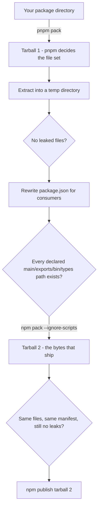

# @anizoptera/publish-clean

[](https://www.npmjs.com/package/@anizoptera/publish-clean)
[](https://www.npmjs.com/package/@anizoptera/publish-clean#provenance)
[](https://github.com/Anizoptera/publish-clean/actions/workflows/check.yml)
[](LICENSE)

[](package.json)
[](package.json)
[](https://pnpm.io/cli/pack)
[](https://bun.sh/docs/cli/test)

When you run `npm publish`, two things ship that you probably did not mean to ship.

The first is your `package.json`. It is a development manifest. It lists devDependencies,
config blocks for your test runner and linter and formatter, `packageManager`,
`workspaces`, `pnpm` settings, release-tool settings, and every script you run locally.
npm sends all of it, unchanged, to everyone who installs your package. In a pnpm
workspace it can also send `workspace:*` and `catalog:` specs that were never resolved,
and those break the install for every consumer.

The second is files. A `.env`, an `.npmrc` with a token in it, a stray `.pem`, your
tests, `.github/`, a lockfile. You do not see the tarball before it goes out, and once a
version is published you cannot edit it. Unpublishing only works for a short window and
under conditions npm decides.

`publish-clean` packs the package, rewrites the manifest of the extracted copy down to
what consumers actually use, packs that, and publishes the result. Your working tree is
never modified. If the artifact still has something in it that should not ship, or
declares a `main`, `exports`, or `bin` path that is not in the tarball, it fails instead
of publishing.

It uses pnpm to pack and npm to publish, and cleans the manifest in between. The
reasoning behind that is in [Why it works this way](#why-it-works-this-way).

## Install

```bash
pnpm add -D @anizoptera/publish-clean
```

That installs one package and nothing else. `publish-clean` has zero runtime
dependencies: it is a single file that talks to `pnpm`, `npm` and `tar` through the
tools you already have. For something that sits on your publish path and handles your
registry credentials, that matters. A publishing tool with a dependency tree is a
supply-chain risk of its own, and this one has no transitive code to audit.

Needs Node.js 20+, and `pnpm`, `npm` and `tar` on `PATH`.

`--provenance` also needs Node.js 22.14+, npm 11.5.1+, and a cloud CI runner. npm will
not sign a publish that came from your laptop.

## Package managers

Start `publish-clean` with any package manager and it still packs with `pnpm` and
publishes with `npm`. So both have to be installed even if your project uses neither. The
reasons are in [Why it works this way](#why-it-works-this-way).

| Your project | How to run it             | What to expect                                            |
| ------------ | ------------------------- | --------------------------------------------------------- |
| pnpm         | `pnpm exec publish-clean` | Everything works, no warning.                             |
| npm          | `npm exec publish-clean`  | Works. Prints an advisory that packing goes through pnpm. |
| Yarn         | `yarn publish-clean`      | Same as npm.                                              |
| Bun          | `bunx publish-clean`      | Same as npm.                                              |

The advisory is a warning on stderr, not an error. Nothing behaves differently because of
it and there's no flag to silence it. Worth seeing once if the rest of your pipeline runs
on something other than pnpm.

For a single package all four behave the same, since nothing in the manifest needs
resolving before it ships.

Monorepos are where it matters. `pnpm pack` resolves `workspace:` and `catalog:` specs
from a real pnpm workspace, meaning a `pnpm-workspace.yaml` with an installed
`node_modules` beside it. A workspace declared the Yarn or Bun way, through the
`workspaces` array in the root `package.json`, isn't one. Neither is a pnpm workspace you
haven't run `pnpm install` in yet. Either way packing stops on pnpm's own error:

```
ERR_PNPM_CANNOT_RESOLVE_WORKSPACE_PROTOCOL
```

Which is what you want. Nothing gets published, and a manifest that would have been
uninstallable for everyone never reaches the registry.

So a Yarn or Bun monorepo can use `publish-clean` for packages with no `workspace:`
dependencies, and needs a pnpm workspace for the ones that have them. A pnpm monorepo
needs nothing it doesn't already have.

## Pick your setup

### Publishing a public package from CI

The common case. `id-token: write` is what lets npm sign the release. Once trusted
publishing is configured for the package, no npm token is involved at all.

```yaml
# .github/workflows/release.yml
permissions:
  contents: read
  id-token: write
steps:
  - uses: actions/checkout@v7
  - uses: pnpm/action-setup@v6
  - uses: actions/setup-node@v7
    with:
      node-version: "24"
      registry-url: https://registry.npmjs.org
  - run: pnpm install --frozen-lockfile
  - run: pnpm run build
  - run: pnpm exec publish-clean -- --access public --tag latest --provenance
```

Always pass the dist-tag. npm defaults to `latest`, which is wrong for a prerelease and
easy to forget.

Publishing a package name for the first time cannot use trusted publishing at all. That
case has its own page: [docs/first-publish.md](docs/first-publish.md).

To stop a stray `npm publish` from bypassing all of this:

```json
{
  "scripts": {
    "prepublishOnly": "node -e \"console.error('Publish with publish-clean.'); process.exit(1)\""
  }
}
```

### Keeping your existing release tool

If Changesets, semantic-release, release-it or np already owns your releases, use
`publish-clean` as a check rather than replacing the publish:

```json
{
  "scripts": {
    "prepublishOnly": "publish-clean --guard-only"
  }
}
```

It packs, cleans and validates, then exits without publishing. A leaked file, an
unresolved `workspace:` spec or a `main` path that is missing from the tarball fails the
release before your tool uploads anything. The limit is real though: your tool still
publishes its own tarball, so you get the checks and not the cleaned manifest.

### Looking at what would be published

```bash
pnpm exec publish-clean --dry-run
```

Prints the paths of the cleaned package and the exact tarball that would be uploaded, and
leaves both on disk. Run `tar tzf` on the tarball and read the rewritten `package.json`.

### Publishing a restricted package

```bash
publish-clean -- --access restricted --tag latest
```

No provenance here, because npm only signs public packages. Do not set `private: true`
either. npm treats it as a publish block, and `publish-clean` refuses it too.

### Publishing one package out of a monorepo

```bash
publish-clean packages/my-lib -- --access public --tag next
```

## How it works



Any gate that fails exits non-zero and nothing is published. `--dry-run` and
`--guard-only` run the whole pipeline and stop before the publish.

## Why it works this way

### Why pnpm does the packing

For a single package, every package manager produces roughly the same tarball. In a
workspace they don't. A dependency written as `"@acme/utils": "workspace:*"` means
"whatever version of that package is in this repo right now". Someone has to turn that
into a real version range before it ships, because to a stranger installing from the
registry `workspace:*` means nothing and the install just fails.

pnpm knows the answer because pnpm built the workspace. `pnpm pack` resolves those specs,
and `catalog:` entries too. `npm pack` copies them out as-is.

That's the whole reason. On every other input pnpm does what the others do; on this one
it's the only one that's correct. Using it everywhere, rather than only inside
workspaces, leaves one file-selection behaviour to reason about instead of a different
one per project layout. There are no file rules of this tool's own, so `files`,
`.npmignore` and packlist defaults do whatever your package manager already does with
them.

### Why the manifest is cleaned on a copy

The tarball gets extracted into a temp directory and rewritten there. Your working tree
is never touched.

The obvious alternative is what a lot of hand-rolled release scripts do: edit
`package.json`, publish, edit it back. That's fine until something dies in the middle,
and then your repo is sitting on a manifest nobody meant to keep. It also can't be run
twice at once. Cleaning a copy has neither problem and costs a directory in `/tmp`.

### Why npm packs the cleaned copy a second time

Give npm a directory and it packs during the upload, so the bytes that reach the registry
only come into existence after the last check has run.

Packing first means they exist before anything is uploaded. They can be listed, compared
against the cleaned directory, scanned for leaks again, kept with `--tarball-out` for a
build attestation, and then published as themselves. What you inspect is what ships. If
cleaning ever dropped a real file, you find out here instead of from a bug report.

The second pack uses `--ignore-scripts`. The first one doesn't, deliberately: `pnpm pack`
runs your `prepare` and `prepack` scripts, which is how your build output gets into the
package at all. Running them again on the cleaned copy could only change it after it was
checked.

### Why npm does the publishing

Provenance, trusted publishing and the registry signature are npm features and work on
npm's path. `npm publish` also takes a tarball directly, which is what the previous step
produced.

## What it checks

`publish-clean` refuses to continue when:

- the package is `private: true`
- the source package has uncommitted changes, unless disabled
- the package has no non-empty `files` array, unless disabled
- the tarball contains critical leaks like `.env`, `.npmrc`, `.git`,
  `node_modules`, or private-key files
- dependency specs still use `catalog:`, `workspace:`, `link:`, or `portal:`
- declared export, type, import, browser, bin, or side-effect paths are missing
  from the cleaned package
- the final npm tarball drops files that were present in the cleaned package
- trusted GitHub publication uses `--provenance` but package repository metadata
  does not match the workflow repository

It warns, without stopping, when it was started by npm, Yarn or Bun rather than pnpm.
The packing still goes through pnpm, but the warning is there because the rest of your
release probably should too.

Leak checks cannot be turned off by any flag or config key.

## What the cleaned manifest keeps

Everything a consumer or a registry reads survives: `name`, `version`, `license`,
`dependencies`, `peerDependencies` and their meta, `exports`, `main`, `module`, `types`,
`bin`, `files`, `engines`, `os`, `cpu`, `sideEffects`, `publishConfig`, and the rest of
the public surface.

What goes: `devDependencies`, `workspaces`, `pnpm`, `packageManager`, `overrides`,
`resolutions`, and the config blocks belonging to test runners, linters, formatters,
coverage tools, build systems and release tools. Scripts go too, apart from the install
lifecycle ones a consumer actually runs: `preinstall`, `install`, `postinstall`,
`prepare` and `uninstall`.

Add your own with `devFields`. Better still, run `--dry-run` and read the manifest that
would ship instead of trusting this list.

## Options

```bash
publish-clean [options] [package-dir] [-- npm-publish-args]
```

- `--dry-run`: pack, check, clean, and print the cleaned package and final
  tarball paths.
- `--guard-only`: run the full pack, clean, and final-tarball guard without
  publishing.
- `--registry URL`: set `publishConfig.registry` on the cleaned manifest.
- `--skip-file-check`: skip suspicious-file checks and the required `files`
  array check. Critical leak checks still run.
- `--no-git-checks`: skip the source git cleanliness check.
- `--tarball-out DIR`: copy the final tarball into `DIR` before publishing. The bytes
  kept are the ones that were published, so a release pipeline can attach them to a
  GitHub Release or sign them with build-provenance attestation.
- `-h`, `--help`: print usage.

Arguments after `--` go to `npm publish`, which publishes the final cleaned
tarball.

Pass the npm dist-tag explicitly. For normal public releases, use
`--tag latest`.

## Package config

Stable project defaults can live in `package.json`:

```json
{
  "publish-clean": {
    "registry": "https://registry.npmjs.org",
    "skipFileCheck": false,
    "noGitChecks": false,
    "devFields": ["customBuildOnlyField"]
  }
}
```

`registry` is written as `publishConfig.registry` on the cleaned manifest and passed to
`npm publish`, so the package cannot end up on whatever registry the machine happens to
be pointed at.

`skipFileCheck` drops the suspicious-file check and the requirement for a `files` array.
Leak checks keep running; those cannot be turned off.

`noGitChecks` allows publishing from a dirty working tree. You need it when you publish
from a build directory or a checkout that is not a git repository.

`devFields` lists extra manifest fields to strip, for tooling this package has not heard
of. Fields that npm or your consumers actually use, like `exports`, `bin`, `engines` and
the dependency maps, are rejected here, so a typo cannot quietly break your package.

Command-line flags override this block. Keep per-release choices such as dist-tags on the
command line.

## What it does not do

It isn't a release manager. It won't pick your version number, write a changelog, tag
anything, push a commit, create a GitHub release, or set up trusted publishing for you.
It also doesn't check that your entry points resolve correctly for consumers, which is
what `publint` and `@arethetypeswrong/cli` are for.

Pick a release manager and a validator to go with it. The next section covers which.

## How it compares

[`clean-publish`](https://github.com/shashkovdanil/clean-publish) is the closest prior
art, and the reason this package exists at all. It copies your source tree into a temp
directory, deletes the files and fields it recognises, and publishes that.

The difference is where the file list comes from. clean-publish starts with your whole
source tree and subtracts, so anything its rules do not recognise gets published.
`publish-clean` starts from what `pnpm pack` produced, which is already the exact file
list your package manager would have shipped, including `files`, `.npmignore`, packlist
rules and resolved `workspace:` specs. Only the manifest is rewritten after that, and the
result is validated again before upload. clean-publish does not re-check its output.

Release managers ([Changesets](https://github.com/changesets/changesets),
[release-please](https://github.com/googleapis/release-please),
[semantic-release](https://github.com/semantic-release/semantic-release),
[release-it](https://github.com/release-it/release-it),
[np](https://github.com/sindresorhus/np)) pick versions, write changelogs, tag, and call
`npm publish`. None of them look inside the tarball. Use one of them together with this,
via the `--guard-only` setup above.

[`publint`](https://publint.dev) and
[`@arethetypeswrong/cli`](https://github.com/arethetypeswrong/arethetypeswrong.github.io)
check that your entry points and type definitions resolve properly for consumers. That is
a different question from what is in the tarball. Run them as well.

`npm publish --dry-run` prints the file list and stops there. It does not clean anything
and will happily list a `.env` without complaining.

[npm trusted publishing](https://docs.npmjs.com/trusted-publishers/) proves who
published. This tool decides what gets published. They solve different halves of the same
worry, and this package is built to use both.

[`pkg-pr-new`](https://github.com/stackblitz-labs/pkg.pr.new) publishes preview builds
per commit without touching the registry. Useful next to this, unrelated to cleaning.

Underlying behaviour is defined by [`npm-packlist`](https://github.com/npm/npm-packlist),
[`npm pack`](https://docs.npmjs.com/cli/v11/commands/npm-pack/),
[`npm publish`](https://docs.npmjs.com/cli/v11/commands/npm-publish/),
[`pnpm pack`](https://pnpm.io/cli/pack) and pnpm
[`publishConfig`](https://pnpm.io/package_json#publishconfig).

## Contributing

```bash
bun install --frozen-lockfile
bun run check
```

[CONTRIBUTING.md](CONTRIBUTING.md) has the rest. Security problems go through private
reporting, not public issues: see [SECURITY.md](SECURITY.md).

## License

Apache-2.0. Copyright 2026 Anizoptera and Art Shendrik.
