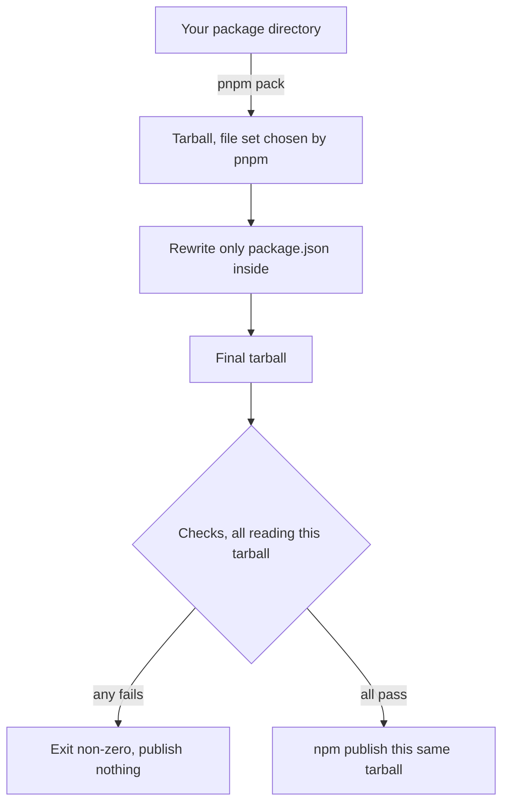

# @anizoptera/publish-clean

Publish npm packages with a clean `package.json`, verified `exports`, and checks for
unwanted files, unresolved workspace dependencies and missing entry points.

[](https://www.npmjs.com/package/@anizoptera/publish-clean)
[](https://www.npmjs.com/package/@anizoptera/publish-clean#provenance)
[](https://github.com/Anizoptera/publish-clean/actions/workflows/check.yml)
[](package.json)
[](package.json)
[](LICENSE)

`publish-clean` removes `devDependencies`, workspace settings and tool config from the
published manifest. Consumer fields and lifecycle helpers stay. Unknown fields are
reported for review and kept unless you choose to remove them.

It packs once with pnpm, cleans the manifest inside the tarball, checks that file, then
uploads it with npm. The checked bytes are the published bytes. Cleaning leaves your
source files alone; your pack hooks still run and can change them.

Check, then publish:

```sh
pnpm exec publish-clean verify
pnpm exec publish-clean -- --access public --tag latest --provenance
```

`verify` runs every check and publishes nothing. It works on a `private: true` package, so
a package that never goes to a registry can still be checked by the rules it would face.

Requires Node.js 22+ and pnpm, plus npm to publish. The CLI has no runtime dependencies. The publish
command above needs [CI provenance setup](#publishing-a-public-package-from-ci).

pnpm 12 installs its native binary from its own install script, so install it with build
scripts allowed — under Bun, which blocks them by default, list `pnpm` in
`trustedDependencies`. Otherwise pnpm's command stays a placeholder that this tool cannot
start. pnpm 11 needs nothing special.

## Install

| Project | Install                                 | Run                       |
| ------- | --------------------------------------- | ------------------------- |
| pnpm    | `pnpm add -D @anizoptera/publish-clean` | `pnpm exec publish-clean` |
| Bun     | `bun add -d @anizoptera/publish-clean`  | `bunx publish-clean`      |
| npm     | `npm i -D @anizoptera/publish-clean`    | `npm exec publish-clean`  |
| Yarn    | `yarn add -D @anizoptera/publish-clean` | `yarn publish-clean`      |

Both `pnpm` and `npm` must be on `PATH` to publish, including in Bun, npm and Yarn projects
and CI. `pnpm` alone is enough to check one: `verify` and `--dry-run` stop before the upload,
so they never start npm. The CLI is one JavaScript file with no runtime dependencies. pnpm
and npm are separate requirements, not bundled dependencies.

For trusted publishing, use Node.js 22.14+ and npm 11.5.1+. Provenance requires a public
package, a public source repository and a supported CI provider. See
[npm's requirements](https://docs.npmjs.com/trusted-publishers/).

### Running it under Bun

gzip bytes depend on the runtime and version executing the CLI. To run it under Bun,
pass Bun the **file path**:

```sh
bun ./node_modules/.bin/publish-clean
```

The installed command has a Node shebang. Passing the file directly avoids relying on
how a package runner selects an interpreter or changes the child tools' environment.

Keep the runtime and its version fixed when rebuilding a release artifact. Node and
Bun can encode the same archive contents into different gzip bytes, which changes the
artifact's hash.

## Package managers

The CLI uses pnpm for workspace resolution and `publishConfig` overrides, and npm to upload the
checked tarball. The [packer comparison](https://github.com/Anizoptera/publish-clean/blob/main/docs/why-pnpm-and-npm.md) explains the trade-offs.

Starting through another package manager prints an advisory on stderr. It does not change
the packer or stop publication, and there is no option to suppress it.

For `workspace:` and `catalog:` specs, pnpm needs the installed dependency in the packing
package's own `node_modules`. Compatibility depends on your install layout.

Bun gives each package its own `node_modules`, so a Bun workspace packs as it stands: no
`pnpm-workspace.yaml`, no switching package managers. Yarn hoists workspace dependencies
to the root instead, so pnpm doesn't find them, and Yarn PnP writes no `node_modules` at
all. Both need a `pnpm-workspace.yaml` and one `pnpm install` before packing works. A Yarn
package with no `workspace:` or `catalog:` specs needs neither, because there's nothing to
resolve.

Install the workspace before packing. An unresolved workspace dependency stops packing:

```
ERR_PNPM_CANNOT_RESOLVE_WORKSPACE_PROTOCOL
```

Install with the layout described above, then retry.

## Pick your setup

### Publishing a public package from CI

Configure an npm trusted publisher for your repository and workflow filename, with
permission for direct `npm publish`. In the publish job, grant `id-token: write` so npm
can authenticate through GitHub OIDC without an npm token. Run tests in a separate job
and make the publish job depend on their success.

```yaml
# Inside the publish job, after its required check jobs have passed:
permissions:
  contents: read
  id-token: write
steps:
  - uses: actions/checkout@v7
  - uses: pnpm/action-setup@v6
    # Set packageManager in package.json to select your pnpm version.
  - uses: actions/setup-node@v7
    with:
      node-version: "24"
      registry-url: https://registry.npmjs.org
  - run: pnpm install --frozen-lockfile
  - run: pnpm run build
  - run: pnpm exec publish-clean -- --access public --tag latest --provenance
```

Use `--tag latest` for stable releases and `--tag next` for prereleases. npm defaults
to `latest`, so omitting the tag can give ordinary installs a prerelease.

For a new package name, follow the [first-publish setup](https://github.com/Anizoptera/publish-clean/blob/main/docs/first-publish.md).

To block direct publication from your source directory, add this hook. Publishing a
tarball does not run it:

```json
{
  "scripts": {
    "prepublishOnly": "node -e \"console.error('Publish with publish-clean.'); process.exit(1)\""
  }
}
```

### Keeping your existing release tool

If your release tool supports a custom upload command, use `publish-clean` there.
For a preview check only, add:

```json
{
  "scripts": {
    "prepublishOnly": "publish-clean verify"
  }
}
```

It checks a pnpm-produced preview and exits without publishing. Your release tool still
creates and uploads its own artifact, which may differ: this gate does not validate those
uploaded bytes or clean their manifest. To publish the checked bytes, configure that tool
to invoke `publish-clean` for the upload instead.

### Looking at what would be published

```bash
pnpm exec publish-clean --dry-run
```

Prints the checked file list and cleaned `package.json`. Add `--tarball-out DIR` to keep
the tarball; otherwise temporary files are removed.

### Publishing a restricted package

```bash
publish-clean -- --access restricted --tag latest
```

Omit provenance for restricted packages. Leave `private: true` unset: it prohibits
publication, even to a private registry.

### Publishing one package out of a monorepo

```bash
publish-clean packages/my-lib -- --access public --tag next
```

## How it works



`verify` and `--dry-run` validate the artifact, but skip publication preflight.
Neither proves that registry access, credentials, provenance requirements or repository
identity are correct. Pack hooks still run, including any network operations they perform.

## Why it works this way

### Why cleaning happens in the tarball

Cleaning stays out of the source tree so an interrupted publish cannot leave your
`package.json` half-edited. Pack hooks still run in the source directory and may change it.

### Why the tarball is edited instead of packed again

Uploading the checked tarball prevents npm from choosing files again.
Cleaning removes `files` from its manifest because installation no longer needs that
packing instruction. Repacking the cleaned directory could then fall back to ignore rules
and drop files the first pack included.

Only `package/package.json` is replaced. Other archive entries retain their bytes,
order and metadata, including pnpm's owner `0:0`, fixed timestamps and file modes.
The reader resolves USTAR, PAX and GNU long-name paths before checking files and rejects
malformed or unsupported path metadata. A path too long for a plain tar name is stated by a
header in front of the entry it names, so every guard judges the path the archive actually
extracts to rather than the placeholder in the entry's own header.

`pnpm pack` runs pack hooks, including `prepare` and `prepack`. npm runs no package
lifecycle scripts when uploading a tarball, so those hooks cannot change the checked
artifact during upload.

## What it checks

Every finding prints as `publish-clean [severity] rule-id at where`. The id in brackets below is
that id — search this file for the one in your output.

Publication stops when:

- the package is marked `private: true`
- the working tree has uncommitted changes (`--no-git-checks` to allow it). A directory under no
  version control has no commit to differ from, so it warns and continues instead
- the package has no non-empty `files` array (`--skip-file-check` to allow it)
- the tarball contains a recognised test, CI, lockfile or `tsconfig` path
  (`--allow-suspicious` to allow it) [`suspicious-file`]
- a filename matches the protected rules for environment files, npm credentials [`secret-file`],
  or Git internals and `node_modules` [`internal-file`]; these checks cannot be disabled
- a dependency is still written as `catalog:`, `workspace:`, `link:` or `portal:`, or a local
  dependency points outside the shipped files [`monorepo-only-spec`]
- a declared entry point cannot resolve against the shipped files; checks account for
  extension lookup, conditions and fallbacks. A declared path no consumer can resolve — an object
  `browser`, `sideEffects`, an internal `#` import, a `*` pattern matching no packed file — reports
  and continues instead [`declared-path-inert`], and `--strict` refuses it
- rewriting the manifest changed anything else in the tarball
- GitHub trusted publishing or provenance is enabled, but the `repository` in your manifest
  is not the repository the workflow is running in
- a `require` condition resolves to an ES module [`require-branch-is-esm`]. Node can require one
  only from 20.19 and 22.12 onward, a consumer can switch that off, and top-level await fails on
  every version. Point `require` at a CommonJS build, or add a `module-sync` branch
- a condition sits out of canonical order where reordering it would change what somebody resolves,
  and a consumer really loses its target — a runtime-specific build shadowed by a generic one. The
  tool will not guess here, so it reports and stops instead [`exports-condition-order-unsafe`]
- two packed names differ only in letter case or Unicode form [`packed-name-collision`]. They
  collapse onto one path on macOS and Windows, which ignore both by default. Two files means one
  silently overwrites the other and the install still reports success; a file colliding with a
  directory means the install fails outright. Only a case-sensitive filesystem can produce the
  pair, which is why the author never sees it
- a packed name Windows cannot create [`packed-name-unportable`]: a path component named after a
  DOS device (`aux`, `con`, `nul`, `com1`…, with or without an extension), a character such as `:`
  or `?`, a trailing dot or space. Declare `"os": ["!win32"]` if the package genuinely does not run
  there and this stops applying. A path component over 255 bytes is refused regardless, because no
  filesystem accepts one
- a `bin` file has no shebang [`bin-no-shebang`], or its shebang ends in CR
  [`shebang-carriage-return`]. An installer symlinks the file and the command is executed directly,
  so without that first line Linux and macOS fail with `exec format error` and npm has no
  interpreter for its Windows shim. A trailing CR is invisible in an editor and makes the kernel
  look for an interpreter literally named `node\r`. A `bin` file holding a NUL byte in its first
  512 bytes is exempt — it is a compiled binary
- a shipped file imports another by the wrong letter case [`import-case-mismatch`], so it works on
  the author's macOS and fails on a consumer's Linux
- the package imports itself by name through a subpath its `exports` does not expose
  [`self-import-not-exported`], which resolves for nobody — and looks fine in your own repository,
  where it resolves by path
- the tarball holds a file nothing in the package reaches [`unreferenced-file`] — no entry point,
  no import from a reached file, no script. Declare the ones that are deliberate:
  `"publish-clean": { "allowUnreferenced": ["assets"] }`, matched as a prefix, so naming a directory
  covers everything under it. This check only runs when the package has an `exports` field, because
  that is what makes unlisted paths unimportable — without it every shipped file is reachable and
  none is dead.

A malformed registry URL [`registry-not-a-url`], or one carrying a password
[`registry-credentials`], also stops the run. Treat such a password as compromised: it is in your
`package.json` and was about to be published inside the tarball's manifest.

File guards match paths, not file contents. A credential hardcoded inside an otherwise allowed
source file is published and nothing here reports it.

## What it repairs

An `exports` map is order-sensitive: a consumer activates a whole set of conditions at once and
takes the first key in that set, so the order you wrote picks the winner. `publish-clean`
flattens the map into the resolution it produces for every possible consumer, and rewrites it
only when the result is provably identical — dropping a `node` branch that repeats `default`
[`exports-inert-condition`], collapsing `{"default": "./x.js"}` [`exports-redundant-default`], and
putting keys that real resolvers require in a fixed order into it [`exports-condition-order`].
A branch no consumer reaches [`exports-unreachable-branch`], a consumer no branch serves
[`exports-unresolvable`] and a condition name no known runtime or bundler activates
[`exports-unknown-condition`] are reported, never guessed at. Every repair is
reported, lands only in the published manifest, and never touches your source. `--no-heal`, or
`"publish-clean": { "heal": false }`, reports without rewriting.

`types` is the one exception, and the only rewrite here that changes what somebody resolves. Only
a type checker activates it, so nothing that runs your package can tell the difference:

- a `types` branch pointing at JavaScript with no declaration file beside it is **removed**
  [`types-branch-not-declarations`]. It promised an API the package does not carry, and a checker
  was reading that JavaScript as your declarations and typing everything `any`.
- declarations hidden behind a key that leads a checker nowhere are **moved to the front**
  [`types-branch-unreachable`], where every checker looks first.

Both print as errors — fix your source — and neither stops the publish, because the published
artifact is correct. `--no-heal` withholds both rewrites, and then both stop it.

Anything the archive cannot settle is left exactly as you wrote it: a `types` target the package
does not ship is a missing file and keeps that report, and nothing is moved across a condition this
tool does not recognise, since a private name may be meant for a consumer configured to take it.

Still reported and left alone: anything inside a fallback array [`exports-fallback-array`] — Bun
resolves those differently from Node and Deno, so no rewrite is safe for everyone — and any map too
large to enumerate [`exports-too-complex`]. [`docs/exports.md`](https://github.com/Anizoptera/publish-clean/blob/main/docs/exports.md) has
the measured condition sets behind these rules.

## What the cleaned manifest keeps

The cleaner preserves consumer and registry fields: `name`, `version`, `license`,
`dependencies`, `peerDependencies` and their meta, `exports`, `main`, `module`, `types`,
`bin`, `engines`, `os`, `cpu`, `sideEffects` and `publishConfig`, among others.

It removes `files` after packing; installers extract the tarball without using that field.

It also removes `devDependencies`, `workspaces`, `pnpm`, `packageManager`, `overrides`,
`resolutions`, and the config blocks belonging to test runners, linters, formatters,
coverage tools, build systems and release tools. When `preinstall`, `install`, `postinstall`,
`prepare` or `uninstall` exists, the complete scripts block survives: a lifecycle may call
any helper script. Otherwise the development-only scripts block is removed.

Unknown fields are kept and reported:

```
publish-clean [warning] unrecognized-field at 1 manifest field
These manifest fields are not recognised and are retained as-is:
  "someToolConfig"
Strip the ones consumers do not read, and acknowledge the ones they do:
  "publish-clean": { "devFields": ["someToolConfig"] }
  "publish-clean": { "keepFields": ["someToolConfig"] }
```

Unknown fields stay because removing an unfamiliar field can break a consumer's build.
Use `devFields` to remove a field you know is development-only, or `keepFields` to suppress
its report. `--strict` promotes this warning to an error like any other. Inspect the result
with `--dry-run`.

## Options and config

```bash
publish-clean [options] [package-dir] [-- npm-publish-args]
```

Set project defaults in `package.json`. A CLI registry overrides the configured registry;
boolean flags enable their setting. Pass per-release npm options, such as dist-tags, after `--`:

```json
{
  "publish-clean": {
    "registry": "https://registry.npmjs.org",
    "skipFileCheck": false,
    "allowSuspicious": false,
    "noGitChecks": false,
    "devFields": ["customBuildOnlyField"],
    "keepFields": ["contributes"]
  }
}
```

| Flag                 | `package.json`    | What it does                                                                               |
| -------------------- | ----------------- | ------------------------------------------------------------------------------------------ |
| `verify [dir]`       | -                 | Run every check and publish nothing. Works on a `private: true` package. |
| `--verify-only`      | -                 | The `verify` subcommand, for scripts that can only pass flags. |
| `--strict`           | -                 | Treat warnings as errors. Never makes an already-applied repair fatal. |
| `--no-heal`          | `heal: false`     | Report repairable `exports`/`imports` defects without repairing them. |
| `--dry-run`          | -                 | Validate a preview artifact and print its file list and cleaned `package.json`. |
| `--guard-only`       | -                 | Deprecated alias for `verify`; fails on a `private: true` package. |
| `--tarball-out DIR`  | -                 | Copy the final tarball into `DIR` before publishing.                                       |
| `--registry URL`     | `registry`        | Set `publishConfig.registry` on the cleaned manifest, and publish to it.                   |
| `--skip-file-check`  | `skipFileCheck`   | Allow a manifest with no `files` array.                                                    |
| `--allow-suspicious` | `allowSuspicious` | Allow tests, CI config, lockfiles or `tsconfig` in the artifact.                           |
| `--no-git-checks`    | `noGitChecks`     | Allow publishing from a dirty working tree.                                                |
| -                    | `devFields`       | Extra manifest fields to strip.                                                            |
| -                    | `keepFields`      | Fields that belong in the published package, so stop reporting them.                       |
| -                    | `allowUnreferenced` | Shipped paths nothing imports on purpose. Prefixes match whole subtrees.                 |
| -                    | [`validateArtifact`](#validate-the-final-artifact) | Run your checks on the cleaned tarball before copying or publishing it. |
| `-h`, `--help`       | -                 | Print usage, every flag, and the config keys.                                              |
| `-v`, `--version`    | -                 | Print the installed version.                                                               |

Arguments after `--` accept publication options only; `--help` lists them. Extra package
operands, workspace selectors, unknown options and values starting with `-` are rejected
so npm cannot substitute an unchecked package. For a filename starting with `-`, use `./`.
Pass the dist-tag explicitly: `--tag latest` for a normal public release.

`--tarball-out` saves the checked bytes in every mode, before any upload. You can inspect
them, attach them to a release or attest them, even if publication fails.

`registry` sets both the general and package-scope destination in the cleaned manifest.
Registry URLs must not contain usernames or passwords, including scoped destinations in
`publishConfig`. Configure npm authentication in npm configuration instead.

`skipFileCheck` waives the manifest's `files` requirement. `allowSuspicious` permits the
listed development files. Neither disables the protected filename checks.

Use `noGitChecks` to publish from a checkout whose working tree is dirty. A directory outside any
Git repository does not need it: there is no commit there for a tree to differ from, so the check
reports that it was skipped and the run continues.

`devFields` refuses known consumer fields such as `exports`, `bin`, `engines` and dependency
maps to prevent accidental removal.

Use `keepFields` for consumer fields the tool does not recognise, such as a VS Code
extension's `contributes` and `publisher`. It suppresses reports; it does not restore stripped fields.

### Validate the final artifact

Use `validateArtifact` to check what users will install, such as package imports or type declarations. Add the command to your `package.json`:

```json
{
  "publish-clean": {
    "validateArtifact": ["node", "scripts/check-artifact.mjs"]
  }
}
```

This runs `node scripts/check-artifact.mjs /absolute/path/to/package.tgz` from your package directory. Read the tarball path from `process.argv.at(-1)`; configured arguments come before it.

The command runs once after built-in checks and before publication or a `--tarball-out` copy. It also runs in `verify` and `--dry-run` modes. The config is removed from the published manifest.

The first item must name an executable on `PATH` or by its path. Use `node` or `bun` to run scripts, including on Windows; `.cmd` shims are not supported. Arguments are passed literally, without a shell: no pipes, redirection or environment assignments. Relative paths start at your package directory.

Exit with code 0 to pass or a nonzero code to reject the package. A failed launch, failed check, or changed or deleted tarball stops publication and copying. Output is hidden on success and shown on failure, with a capture limit to bound memory use. Cancellation stops the command and its child processes before removing temporary files.

Your script runs with your permissions. Keep it read-only and wait for its child processes to finish; publish-clean does not sandbox it or protect other project files.

Check the supplied tarball. Packing again checks different bytes; calling publish-clean from the script runs the same hook again.

## What it does not do

Use your release tool for versions, changelogs, tags and GitHub releases. Configure trusted
publishing separately. Built-in checks verify declared paths. To test package imports or
type declarations, supply a [validation command](#validate-the-final-artifact).

Bundled `node_modules` are not allowed. pnpm may first reject `bundleDependencies` with:

```
Add "nodeLinker: hoisted" to pnpm-workspace.yaml or delete bundleDependencies
```

A hoisted layout can make pnpm pack them, but the resulting `node_modules` entries still
fail this tool's file checks. Use another publication path if you need to ship them.

## Related tools

[`clean-publish`](https://github.com/shashkovdanil/clean-publish) cleans a temporary copy
of the source tree before publishing. `publish-clean` instead cleans a pnpm-produced tarball.

That preserves pnpm's file selection and workspace resolution, and lets the checks read
the same bytes npm uploads.

Release tools such as [Changesets](https://github.com/changesets/changesets),
[semantic-release](https://github.com/semantic-release/semantic-release),
[release-please](https://github.com/googleapis/release-please),
[release-it](https://github.com/release-it/release-it) and [np](https://github.com/sindresorhus/np)
handle release tasks. See [integration](#keeping-your-existing-release-tool) for the
difference between a preview check and publishing through this CLI.

[`publint`](https://publint.dev) and
[`@arethetypeswrong/cli`](https://github.com/arethetypeswrong/arethetypeswrong.github.io)
check package entry points and TypeScript compatibility. Use them alongside this tool.

`npm publish --dry-run` previews npm's publication. It does not clean the manifest or apply
this tool's protected filename rules.

[npm trusted publishing](https://docs.npmjs.com/trusted-publishers/) authorises a CI
workflow to publish. Provenance links a release to its source and build; it does not
check package contents for you.

[`pkg-pr-new`](https://github.com/stackblitz-labs/pkg.pr.new) publishes preview builds
per commit without publishing a version to npm.

Underlying behaviour is defined by [`npm-packlist`](https://github.com/npm/npm-packlist),
[`npm pack`](https://docs.npmjs.com/cli/v11/commands/npm-pack/),
[`npm publish`](https://docs.npmjs.com/cli/v11/commands/npm-publish/),
[`pnpm pack`](https://pnpm.io/cli/pack) and pnpm
[`publishConfig`](https://pnpm.io/package_json#publishconfig).

## Contributing

```bash
bun install --frozen-lockfile
bun run check
```

[CONTRIBUTING.md](https://github.com/Anizoptera/publish-clean/blob/main/CONTRIBUTING.md) has the rest. Security problems go through private
reporting, not public issues: see [SECURITY.md](https://github.com/Anizoptera/publish-clean/blob/main/SECURITY.md).

## License

Apache-2.0. Copyright 2026 Anizoptera and Art Shendrik.
