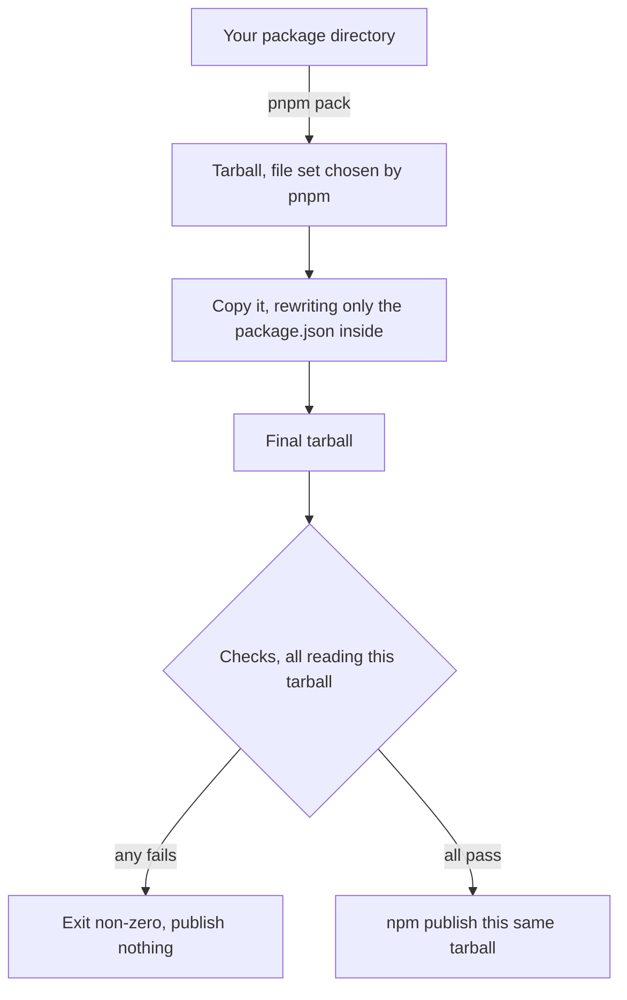

# @anizoptera/publish-clean

Pre-publish npm package cleaner that strips common useless noise and crap from
`package.json`; prevents accidental publication of unwanted things and unresolved
dependencies. No deps, one JS file.

[](https://www.npmjs.com/package/@anizoptera/publish-clean)
[](https://www.npmjs.com/package/@anizoptera/publish-clean#provenance)
[](https://github.com/Anizoptera/publish-clean/actions/workflows/check.yml)
[](package.json)
[](package.json)
[](LICENSE)

When you run `npm publish`, two things ship that you probably did not mean to ship.

The first is your `package.json`. It is a development manifest: devDependencies, config
blocks for your test runner, linter and formatter, `packageManager`, `workspaces`, `pnpm`
settings, release-tool settings, and every script you run locally.
npm sends all of it, unchanged, to everyone who installs your package. In a pnpm
workspace it can also send `workspace:*` and `catalog:` specs that were never resolved,
and those break the install for every consumer.

The second is files. A `.env`, an `.npmrc` with a token in it, a stray `.pem`, your
tests, `.github/`, a lockfile. You do not see the tarball before it goes out, and once a
version is published you cannot edit it. Unpublishing only works for a short window and
under conditions npm decides.

`publish-clean` packs the package once, rewrites the `package.json` inside that tarball
down to what consumers actually use, checks the result, and publishes those exact bytes.
Cleaning does not edit your working tree; your pack lifecycle scripts can. If the artifact still has something in it that should
not ship, or declares a `main`, `exports`, or `bin` path that is not in the tarball, it
fails instead of publishing.

It packs with pnpm and publishes with npm, and cleans the manifest in between. Both
choices are argued, with measurements, in
[why pnpm packs and npm publishes](docs/why-pnpm-and-npm.md).

## Install

| Project | Install                                 | Run                       |
| ------- | --------------------------------------- | ------------------------- |
| pnpm    | `pnpm add -D @anizoptera/publish-clean` | `pnpm exec publish-clean` |
| Bun     | `bun add -d @anizoptera/publish-clean`  | `bunx publish-clean`      |
| npm     | `npm i -D @anizoptera/publish-clean`    | `npm exec publish-clean`  |
| Yarn    | `yarn add -D @anizoptera/publish-clean` | `yarn publish-clean`      |

**Whatever you start it with, `pnpm` prepares the package and `npm` uploads it, so both
must be on `PATH`.** A Bun, npm or Yarn project needs pnpm installed too, including in CI.

Node.js 22+ runs it. npm provenance additionally needs 22.14+, because below that npm
cannot mint it.

That installs one package and nothing else. `publish-clean` has zero runtime
dependencies: it is a single file that talks to `pnpm` and `npm`, and reads and rewrites
the tarball itself, so there is nothing else to have on the machine.

For something that sits on your publish path and handles your
registry credentials, that matters. A publishing tool with a dependency tree is a
supply-chain risk of its own, and this one has no transitive code to audit.

`--provenance` additionally needs npm 11.5.1+ and a cloud CI runner. npm will not sign a
publish that came from your laptop.

### Running it under Bun

gzip bytes depend on the runtime and version executing the CLI. To run it under Bun,
pass Bun the **file path**:

```sh
bun ./node_modules/.bin/publish-clean
```

The installed command has a Node shebang. Passing the file directly avoids relying on
how a package runner selects an interpreter or changes the child tools' environment.

Either runtime produces valid gzip with identical contents, so the choice is free. The one
rule is not to switch runtimes _within_ a version: if a release is re-run to repair its
artifacts, the bytes have to come out the same, and the two encoders do not agree.

## Package managers

pnpm resolves workspace dependencies and applies its manifest overrides; npm uploads the
resulting tarball. Compatibility evidence and limitations live in
[why pnpm packs and npm publishes](docs/why-pnpm-and-npm.md).

Started with anything other than pnpm, it prints an advisory on stderr saying so. That is
a warning, not an error. Nothing behaves differently because of it, and there is no flag
to silence it.

For a single package every manager behaves the same, since nothing in the manifest needs
resolving before it ships.

Monorepos are where it matters. `pnpm pack` resolves `workspace:` and `catalog:` specs by
finding the dependency inside the packing package's own `node_modules`. What decides
whether that works is the layout your installer left behind, not which installer it was.

Bun gives each package its own `node_modules`, so a Bun workspace packs as it stands: no
`pnpm-workspace.yaml`, no switching package managers. Yarn hoists workspace dependencies
to the root instead, so pnpm doesn't find them, and Yarn PnP writes no `node_modules` at
all. Both need a `pnpm-workspace.yaml` and one `pnpm install` before packing works. A Yarn
package with no `workspace:` or `catalog:` specs needs neither, because there's nothing to
resolve.

Either way the workspace has to be installed. Pack one nobody has installed and it stops
on pnpm's own error:

```
ERR_PNPM_CANNOT_RESOLVE_WORKSPACE_PROTOCOL
```

Which is what you want. Nothing gets published, and a manifest that would have been
uninstallable for everyone never reaches the registry. Run your usual install and pack
again.

## Pick your setup

### Publishing a public package from CI

The common case. `id-token: write` is what lets npm sign the release. Once trusted
publishing is configured for the package, no npm token is involved at all.

```yaml
# .github/workflows/release.yml
permissions:
  contents: read
  id-token: write
steps:
  - uses: actions/checkout@v7
  - uses: pnpm/action-setup@v6
  - uses: actions/setup-node@v7
    with:
      node-version: "24"
      registry-url: https://registry.npmjs.org
  - run: pnpm install --frozen-lockfile
  - run: pnpm run build
  - run: pnpm exec publish-clean -- --access public --tag latest --provenance
```

Always pass the dist-tag. npm defaults to `latest`, which is wrong for a prerelease and
easy to forget.

Publishing a package name for the first time cannot use trusted publishing at all. That
case has its own page: [docs/first-publish.md](docs/first-publish.md).

To stop a stray `npm publish` from bypassing all of this:

```json
{
  "scripts": {
    "prepublishOnly": "node -e \"console.error('Publish with publish-clean.'); process.exit(1)\""
  }
}
```

### Keeping your existing release tool

If Changesets, semantic-release, release-it or np already owns your releases, use
`publish-clean` as a check rather than replacing the publish:

```json
{
  "scripts": {
    "prepublishOnly": "publish-clean --guard-only"
  }
}
```

It checks a pnpm-produced preview and exits without publishing. Your release tool still
creates and uploads its own artifact, which may differ: this gate does not validate those
uploaded bytes or clean their manifest. To publish the checked bytes, configure that tool
to invoke `publish-clean` for the upload instead.

### Looking at what would be published

```bash
pnpm exec publish-clean --dry-run
```

Prints every file that would ship and the cleaned `package.json`, then deletes its temp
tree. Add `--tarball-out DIR` to keep the tarball itself.

### Publishing a restricted package

```bash
publish-clean -- --access restricted --tag latest
```

No provenance here, because npm only signs public packages. Do not set `private: true`
either. npm treats it as a publish block, and `publish-clean` refuses it too.

### Publishing one package out of a monorepo

```bash
publish-clean packages/my-lib -- --access public --tag next
```

## How it works



The checks are listed under [What it checks](#what-it-checks). The point of the shape is
that they all read the tarball that gets uploaded, so what passed the checks and what
reached the registry are the same bytes, not two things that ought to match.

`--dry-run` and `--guard-only` validate the artifact. They do not contact the registry or
validate publication credentials, provenance runtime requirements or repository identity.

## Why it works this way

### Why pnpm packs, and npm publishes

Use the [packer and uploader rationale](docs/why-pnpm-and-npm.md) when evaluating a replacement.
It covers workspace resolution, pnpm overrides, bundled dependencies and the exact-byte
upload requirement. Other clients also support provenance; that feature alone does not
establish equivalent behavior throughout this pipeline.

### Why cleaning happens in the tarball

The manifest is rewritten inside the tarball in a temporary directory.
The cleaner never writes the source manifest; pack hooks still run in
your source directory and may change it.

The obvious alternative is what a lot of hand-rolled release scripts do: edit
`package.json`, publish, edit it back. That's fine until something dies in the middle,
and then your repo is sitting on a manifest nobody meant to keep. It also can't be run
twice at once. Cleaning the temporary tarball avoids those source edits.

### Why the tarball is edited instead of packed again

Give npm a directory and it packs during the upload, so the bytes that reach the registry
only come into existence after the last check has run. Packing first means they exist
before anything is uploaded: they can be listed, scanned for leaks, kept with
`--tarball-out` for a build attestation, and then published as themselves. What you
inspect is what ships.

So the manifest has to be cleaned inside a tarball that already exists. The obvious way is
to unpack, edit, and pack again — and it is wrong. `files` is a packing instruction, and
cleaning removes it, because it is useless to anyone installing the package. A second pack
then has nothing left to select with, falls back to your `.gitignore`/`.npmignore` for
exclusion, and quietly drops files the first pack included. A package shipping a
`.gitignore` that excludes any other shipped file loses it.

Editing avoids the question. Only the `package/package.json` member is replaced. Every
other entry's raw bytes are preserved. The reader resolves USTAR prefixes and PAX paths
before scanning; malformed or unsupported path metadata is refused. This keeps pnpm's
normalised metadata: owner `0:0`, a fixed
timestamp and file modes. A plain `tar` invocation would replace those with whatever the build
machine happens to have.

Lifecycle scripts run once, at the first pack. `pnpm pack` runs your `prepare` and
`prepack`, which is how build output reaches the package at all. npm skips package lifecycle
scripts for a tarball input, so upload does not rerun hooks against the checked artifact.

## What it checks

`publish-clean` stops, and publishes nothing, when:

- the package is marked `private: true`
- the working tree has uncommitted changes (`--no-git-checks` to allow it)
- the package has no non-empty `files` array (`--skip-file-check` to allow it)
- the tarball holds tests, CI config, a lockfile or a `tsconfig` (`--allow-suspicious` to
  allow it — a separate switch from the one above, so waiving a manifest convention never
  silently disarms the artifact scan)
- the tarball holds something that should never ship: a `.env`, an `.npmrc`, `.git`,
  `node_modules`, or a private key. This one has no off switch, by any flag or config key
- a dependency is still written as `catalog:`, `workspace:`, `link:` or `portal:`, or a local
  dependency points outside the shipped files
- the manifest points `exports`, `types`, `main`, `browser`, `bin` or `sideEffects` at a
  path that is not in the tarball
- rewriting the manifest changed anything else in the tarball
- you asked for `--provenance` from GitHub Actions, but the `repository` in your manifest
  is not the repository the workflow is running in

It warns, without stopping, when it was started by npm, Yarn or Bun rather than pnpm. The
packing still goes through pnpm, but the warning is there because the rest of your release
probably should too.

## What the cleaned manifest keeps

Everything a consumer or a registry reads survives: `name`, `version`, `license`,
`dependencies`, `peerDependencies` and their meta, `exports`, `main`, `module`, `types`,
`bin`, `engines`, `os`, `cpu`, `sideEffects`, `publishConfig`, and the rest of the public
surface.

`files` goes, because it is spent: it told the packer what to include, the tarball already
exists, nothing re-selects afterwards, and an install extracts every entry unfiltered. npm
agrees — its registry drops the field from the metadata it serves.

What else goes: `devDependencies`, `workspaces`, `pnpm`, `packageManager`, `overrides`,
`resolutions`, and the config blocks belonging to test runners, linters, formatters,
coverage tools, build systems and release tools. Scripts go too, apart from the install
lifecycle ones a consumer actually runs: `preinstall`, `install`, `postinstall`,
`prepare` and `uninstall`.

Anything the tool does not recognise ships, and you get told it did:

```
publish-clean: these manifest fields are not recognised and are retained as-is:
  "someToolConfig"
Strip the ones consumers do not read, and acknowledge the ones they do:
  "publish-clean": { "devFields": ["someToolConfig"] }
  "publish-clean": { "keepFields": ["someToolConfig"] }
```

The strip list cannot know about a tool invented after it was written, so new
`package.json` keys would otherwise leak into every install unnoticed. Dropping them
instead would be worse: a key some consumer actually resolves would vanish, and you would
hear about it from a stranger's broken build rather than from your own release.

Add your own with `devFields`. Better still, run `--dry-run` and read the manifest that
would ship instead of trusting this list.

## Options and config

```bash
publish-clean [options] [package-dir] [-- npm-publish-args]
```

Most settings can be a flag or a `package.json` key. Flags win, so keep per-release
choices like dist-tags on the command line and stable project policy in the manifest:

```json
{
  "publish-clean": {
    "registry": "https://registry.npmjs.org",
    "skipFileCheck": false,
    "allowSuspicious": false,
    "noGitChecks": false,
    "devFields": ["customBuildOnlyField"],
    "keepFields": ["contributes"]
  }
}
```

| Flag                 | `package.json`    | What it does                                                                               |
| -------------------- | ----------------- | ------------------------------------------------------------------------------------------ |
| `--dry-run`          | -                 | Validate a preview artifact and print its file list and cleaned `package.json`. |
| `--guard-only`       | -                 | Validate a preview artifact without the file list or manifest output. |
| `--tarball-out DIR`  | -                 | Copy the final tarball into `DIR` before publishing.                                       |
| `--registry URL`     | `registry`        | Set `publishConfig.registry` on the cleaned manifest, and publish to it.                   |
| `--skip-file-check`  | `skipFileCheck`   | Allow a manifest with no `files` array.                                                    |
| `--allow-suspicious` | `allowSuspicious` | Allow tests, CI config, lockfiles or `tsconfig` in the artifact.                           |
| `--no-git-checks`    | `noGitChecks`     | Allow publishing from a dirty working tree.                                                |
| -                    | `devFields`       | Extra manifest fields to strip.                                                            |
| -                    | `keepFields`      | Fields that belong in the published package, so stop reporting them.                       |
| `-h`, `--help`       | -                 | Print usage, every flag, and the config keys.                                              |
| `-v`, `--version`    | -                 | Print the installed version.                                                               |

Arguments after `--` go to `npm publish`. Pass the dist-tag explicitly: `--tag latest` for
a normal public release.

A few of these deserve a sentence more.

`--tarball-out` keeps the bytes that were published, so a release pipeline can attach them
to a GitHub Release or sign them with build-provenance attestation. The copy happens in
every mode, before the publish, so you get the validated artifact even if the upload fails.

`registry` pins where the package goes, so it cannot end up on whatever registry the
machine happens to be pointed at.

`skipFileCheck` and `allowSuspicious` are deliberately two switches. A missing `files`
array is a manifest convention some packages do not follow; tests or a lockfile in the
tarball is content nobody meant to ship. Neither touches the leak checks, which have no
off switch at all.

`noGitChecks` is what you need when you publish from a build directory, or from a checkout
that is not a git repository at all.

`devFields` refuses fields that npm or your consumers actually read, like `exports`, `bin`,
`engines` and the dependency maps, so a typo cannot quietly break your package.

`keepFields` answers the unrecognised-field report the other way: the field belongs in the
published package, stop mentioning it. A VS Code extension needs `contributes` and
`publisher` in the artifact to work, and no generic publishing tool is ever going to know
that.

## What it does not do

It isn't a release manager. It won't pick your version number, write a changelog, tag
anything, push a commit, create a GitHub release, or set up trusted publishing for you. It
checks declared paths, not whether the JavaScript executes or the type declarations work
for every consumer. Pair it with a release manager and a validator; the next section names them.

It can't publish a package that uses `bundleDependencies`. pnpm links dependencies rather
than copying them, so it has nothing to bundle and refuses:

```
Add "nodeLinker: hoisted" to pnpm-workspace.yaml or delete bundleDependencies
```

A hoisted layout can let pnpm bundle dependencies, but this tool still refuses the resulting
`node_modules` entries. Changing the linker does not bypass that artifact policy. Packages
that must ship bundled dependencies need a different publication policy.

## How it compares

[`clean-publish`](https://github.com/shashkovdanil/clean-publish) is the closest prior
art, and the reason this package exists at all. It copies your source tree into a temp
directory, deletes the files and fields it recognises, and publishes that.

`publish-clean` starts from what `pnpm pack` produced, which is the file
list your package manager would have shipped, including `files`, `.npmignore`, packlist
rules and resolved `workspace:` specs. Only the manifest is rewritten after that, and the
result is validated again before upload.

Release managers ([Changesets](https://github.com/changesets/changesets),
[release-please](https://github.com/googleapis/release-please),
[semantic-release](https://github.com/semantic-release/semantic-release),
[release-it](https://github.com/release-it/release-it),
[np](https://github.com/sindresorhus/np)) pick versions, write changelogs, tag, and call
`npm publish`. See the `--guard-only` setup above for its preview-only boundary; configure
the upload through `publish-clean` when the release must use the checked artifact.

[`publint`](https://publint.dev) and
[`@arethetypeswrong/cli`](https://github.com/arethetypeswrong/arethetypeswrong.github.io)
check that your entry points and type definitions resolve properly for consumers. That is
a different question from what is in the tarball. Run them as well.

`npm publish --dry-run` prints the file list and stops there. It does not clean anything
and will happily list a `.env` without complaining.

[npm trusted publishing](https://docs.npmjs.com/trusted-publishers/) proves who
published. This tool decides what gets published. They solve different halves of the same
worry, and this package is built to use both.

[`pkg-pr-new`](https://github.com/stackblitz-labs/pkg.pr.new) publishes preview builds
per commit without touching the registry. Useful next to this, unrelated to cleaning.

Underlying behaviour is defined by [`npm-packlist`](https://github.com/npm/npm-packlist),
[`npm pack`](https://docs.npmjs.com/cli/v11/commands/npm-pack/),
[`npm publish`](https://docs.npmjs.com/cli/v11/commands/npm-publish/),
[`pnpm pack`](https://pnpm.io/cli/pack) and pnpm
[`publishConfig`](https://pnpm.io/package_json#publishconfig).

## Contributing

```bash
bun install --frozen-lockfile
bun run check
```

[CONTRIBUTING.md](CONTRIBUTING.md) has the rest. Security problems go through private
reporting, not public issues: see [SECURITY.md](SECURITY.md).

## License

Apache-2.0. Copyright 2026 Anizoptera and Art Shendrik.
